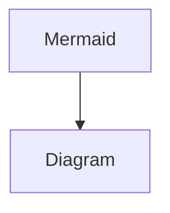
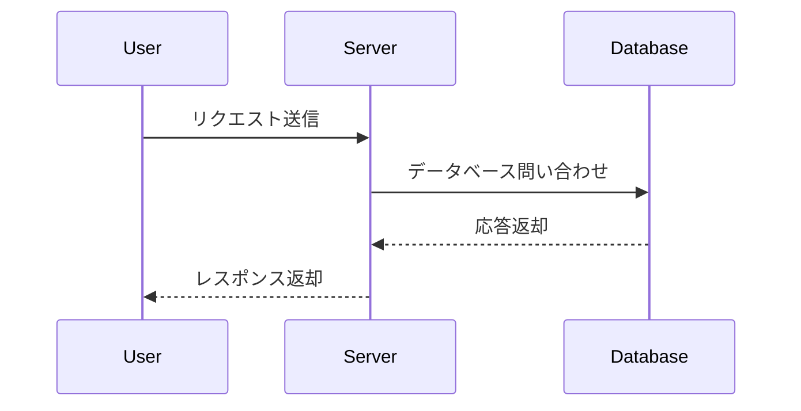
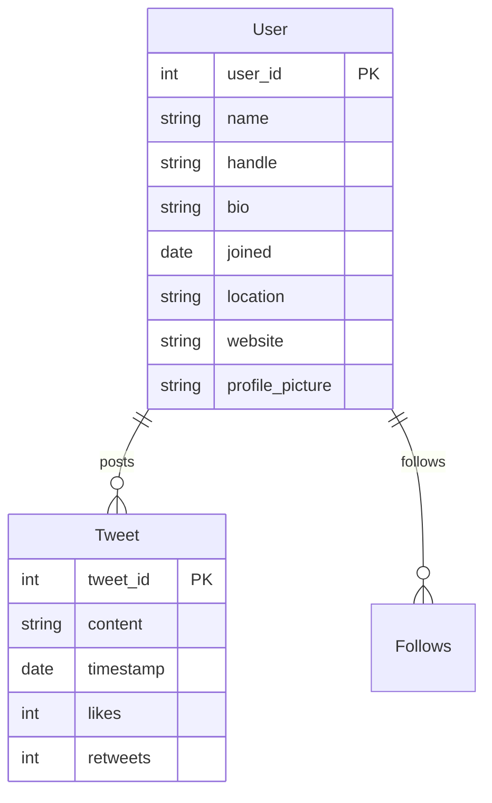
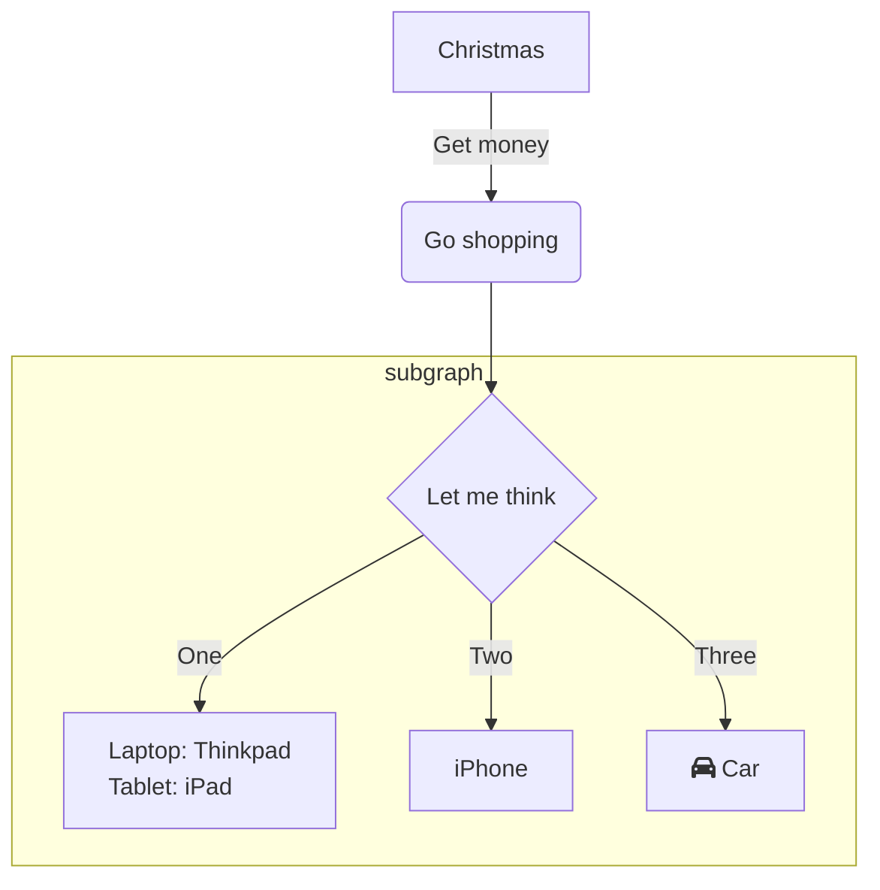

# mermaid

### 普通のグラフ



### シークエンスダイアグラム



### ER 図



### フローチャート



```mermaid

flowchart TD
    A --> B["Laptop: Thinkpad\nTablet&Tab;: iPad"] %% use TAB same as `&#9;`
    C --> D["Laptop: Thinkpad\nTablet : iPad"]     %% use space
    style B text-align:left
    style D text-align:left
```
