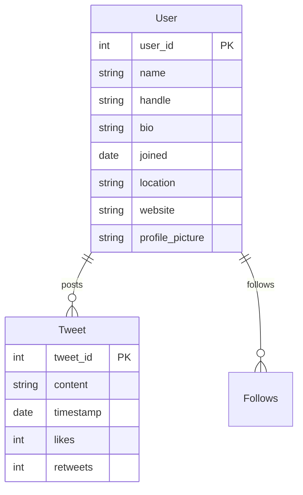
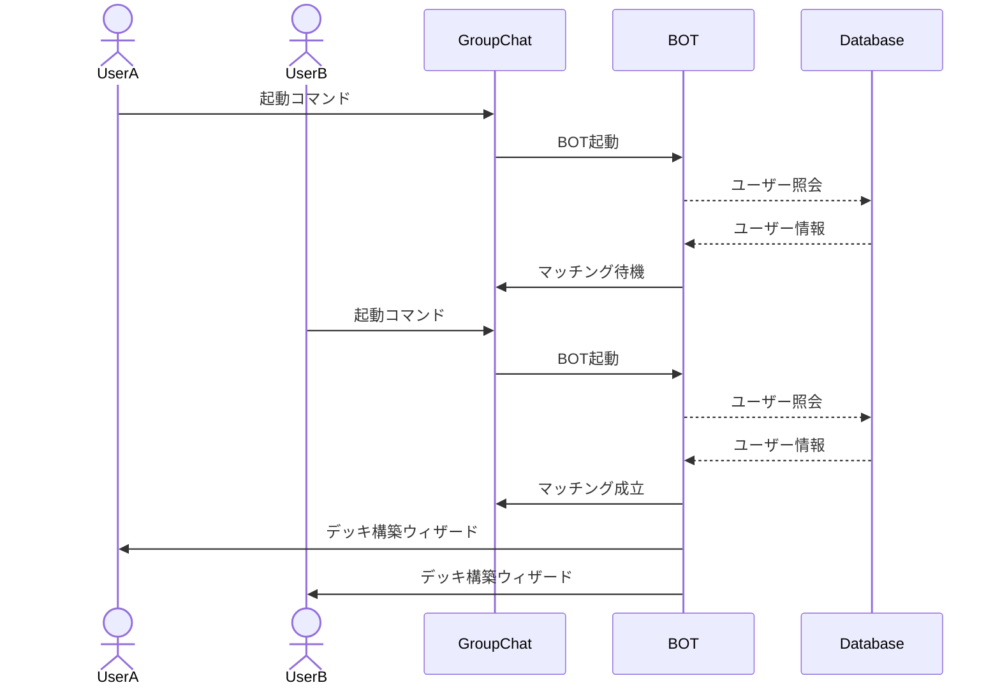
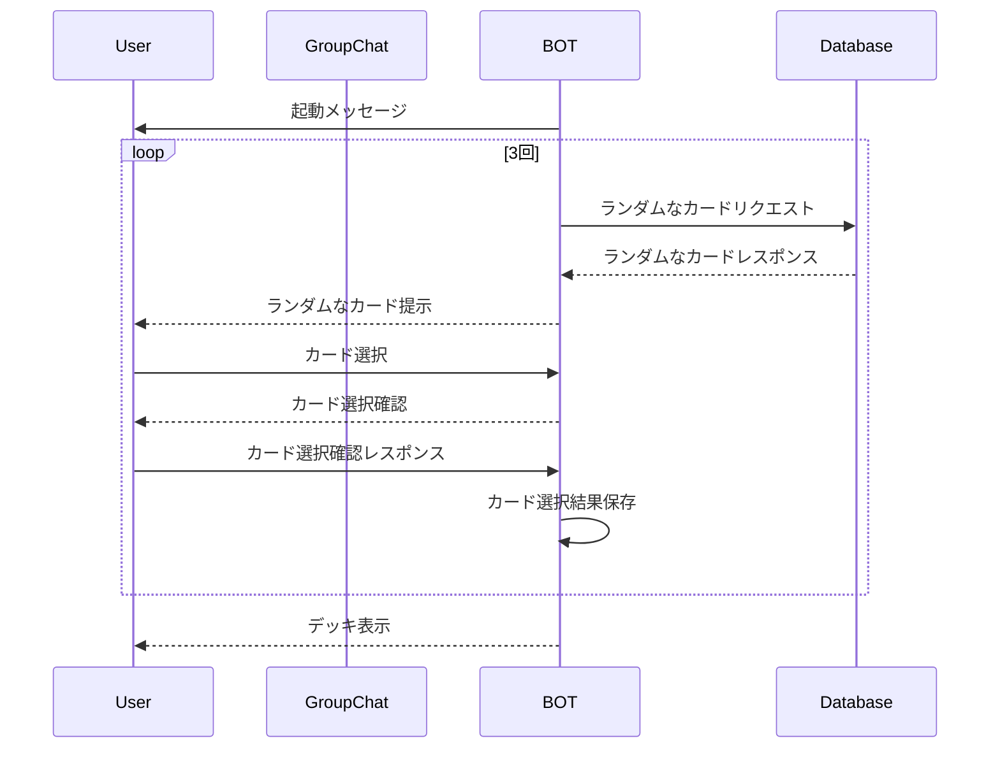

# mermaid

### ER 図

### シークエンスダイアグラム

#### 開始～マッチング成立まで

### デッキ構築ウィザード

#### キャラピック用SQL
~~~SQL
SELECT
*
FROM
M_CARDS
WHERE
CARD_ID in (RN1,RN2,RN3)
~~~
RN: Random Number

#### キャラピック用乱数生成

~~~Python
from random import randint 

# max:乱数の最大値(int)
# exclude_list: 除外する値のリスト(各要素はint)
def Random_Pick(max, exclude_list){
	n = randint(0,max)
	# 無限ループ対策
	if(max <= len(exclude_list)) {
		return -1
	}
	# 生成した乱数が除外リストに含まれていた場合、やりなおし
	if (n in exclude_list) {
		return Random_Pick(max, exclide_list)
	} else {
		return n
	}
}
~~~

#### pythonでSQL実行
~~~python
import mysql.connector

# データベースに接続
connection = mysql.connector.connect(host='localhost',
                                     user='root',
                                     password='MySQLのパスワード',
                                     database='myDB')

sql = "SELECT `id`, `password` FROM `users`"
with connection.cursor() as cursor:
        # データ読み込み
        cursor.execute(sql)
        result = cursor.fetchall()
        print(result)
				# result
				'''
				[
					{‘id’: 1, ‘password’: ‘very-secret1’}, 
					{‘id’: 2, ‘password’: ‘very-secret2’}, 
					{‘id’: 3, ‘password’: ‘very-secret3’}, 
					{‘id’: 4, ‘password’: ‘very-secret4’}, 
					{‘id’: 5, ‘password’: ‘very-secret5’}
				]
				'''
 
# 終了処理
cursor.close()
~~~